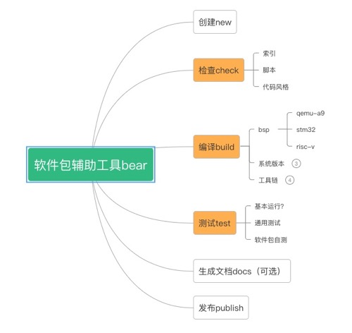

# bear
An RT-Thread software package assisted development tool. | 一个 RT-Thread 软件包辅助开发工具。

## 框图

核心功能:
- 检查：检查软件包格式，及代码风格
- 编译：编译软件包
- 测试：对软件包进行测试

可选功能：
- 创建：创建软件包模板
- 文档：将文档渲染出来，展示在网页里
- 发布：将软件包提交到个人仓库，并提交合并请求
